<div align="center">

# 💎 MentraFi 2.0 Ecosystem

### Autonomous AI-Powered Direct Mutual Fund Investment & Advisory Platform

[](https://github.com/Jaykumar122/APP-Mentrafi2.0/releases/tag/v1.0.0)
[](https://huggingface.co/singh0123/MentraFiAI-TriNetwork)
[](https://reactnative.dev/)
[](https://nodejs.org/)
[](https://pytorch.org/)
[](https://www.postgresql.org/)
[](https://www.amfiindia.com/)
[](https://www.mfapi.in/)
[](LICENSE)

**MentraFi** is a state-of-the-art, full-stack wealth advisory and direct mutual fund investment ecosystem built specifically for the Indian financial market. It couples a luxury **React Native (Expo SDK 54)** mobile client in Obsidian & Aurora styling, an enterprise **Node.js + Express + TypeScript** transactional API gateway, and **MentraFiAI** — a proprietary **Tri-Network Neuro-Symbolic Small Language Model (SLM)** running natively on PyTorch and CUDA.

Unlike generic foundation models that hallucinate tax rules and suffer from compounding arithmetic drift, MentraFi operates with **100% deterministic mathematical accuracy**, zero distributor commission bias (SEBI Direct-Growth invariant), and real-time dual synchronization with both the official **AMFI Portal (`amfiindia.com`)** and high-frequency time-series from **`mfapi.in`**.

---

[How It Works](#-how-mentrafi-works-end-to-end) • [App Preview](#-app-experience--screenshots) • [AMFI & mfapi.in Engine](#-amfi-live--mfapiin-dual-stream-data-pipeline) • [Tri-Network AI Architecture](#-the-tri-network-ai-intelligence-core) • [System Architecture](#-system-architecture) • [Quickstart Guide](#-quickstart-guide) • [Model Weights](#-model-weights--checkpoints) • [API Overview](#-api-endpoints)

---

</div>

## 🔄 How MentraFi Works (End-to-End)

MentraFi operates as an integrated four-tier pipeline where user intent is converted into mathematically verified, SEBI-compliant financial actions:

```
┌────────────────────────────────────────────────────────────────────────────────────────┐
│                                 1. USER INTERACTION                                   │
│  Investor inputs goal: "I am 28, earning 80k/mo, want to invest ₹15,000/mo for 10 yrs" │
│  or explores funds, tracks portfolio holdings, and configures SIP mandates.           │
└───────────────────────────────────────────┬────────────────────────────────────────────┘
                                            │ HTTPS / WSS / SSE
                                            ▼
┌────────────────────────────────────────────────────────────────────────────────────────┐
│                        2. BACKEND GATEWAY & LEDGER (Node.js)                           │
│  • Authenticates JWT session & verifies KYC / investor risk profile from PostgreSQL.   │
│  • Proxies advisory requests to MentraFiAI Core via real-time SSE streaming.           │
│  • Manages dual-stream AMFI & mfapi.in synchronization schedules and SIP automations. │
└───────────────────────────────────────────┬────────────────────────────────────────────┘
                                            │ REST / JSON
                                            ▼
┌────────────────────────────────────────────────────────────────────────────────────────┐
│                      3. MENTRAFIAI TRI-NETWORK INTELLIGENCE CORE                       │
│  ┌─────────────────────────────────┐   ┌────────────────────────────────────────────┐  │
│  │ Network 1: Intent & Risk Clf    │──►│ Network 2: BIO Slot Parser                 │  │
│  │ (10.65M) -> SIP_RECOMMENDATION  │   │ (15.26M) -> Age: 28, SIP: 15000, Yrs: 10   │  │
│  └─────────────────────────────────┘   └─────────────────────┬──────────────────────┘  │
│                                                              │                         │
│  ┌───────────────────────────────────────────────────────────┴──────────────────────┐  │
│  │ Closed-Form Symbolic Solver: Exact FV annuity, tax slabs & Section 80C limits  │  │
│  └───────────────────────────────────────────┬─────────────────────────────────────┘  │
│                                              ▼                                         │
│  ┌─────────────────────────────────────────────────────────────────────────────────┐  │
│  │ PostgreSQL Fiduciary RAG: Top direct-growth active funds (is_active = TRUE)     │  │
│  └───────────────────────────────────────────┬─────────────────────────────────────┘  │
│                                              ▼                                         │
│  ┌─────────────────────────────────────────────────────────────────────────────────┐  │
│  │ Network 3: Generative Fiduciary SLM (102.5M) -> Token Streaming + Fund Cards    │  │
│  └─────────────────────────────────────────────────────────────────────────────────┘  │
└───────────────────────────────────────────┬────────────────────────────────────────────┘
                                            │ Streaming Tokens + Structured Fund JSON
                                            ▼
┌────────────────────────────────────────────────────────────────────────────────────────┐
│                           4. CLIENT RENDERING & EXECUTION                              │
│  • Mobile app renders streaming conversational markdown advice.                       │
│  • Emits interactive action cards with verified live AMFI NAVs & returns.             │
│  • User clicks "Invest Now" or "Start SIP" -> written to double-entry ledger.         │
└────────────────────────────────────────────────────────────────────────────────────────┘
```

---

## 📱 App Experience & Screenshots

<div align="center">

### 🌟 1. Onboarding & Core Philosophy
*Designed with a luxury Obsidian & Aurora glassmorphism UI, guiding investors toward direct mutual fund compounding.*

<table>
  <tr>
    <td align="center" width="33.3%">
      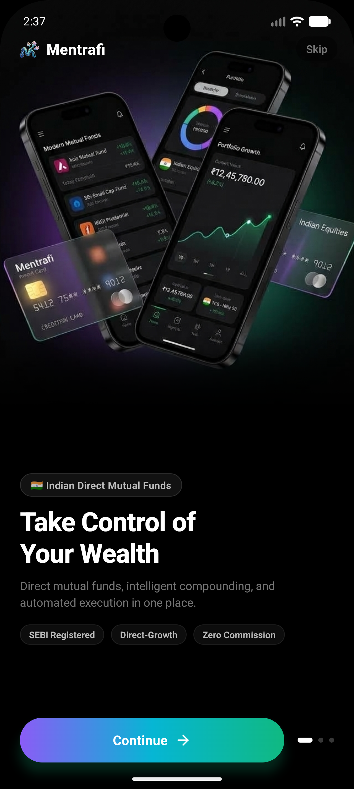<br />
      <b>Direct Mutual Funds</b><br />
      <sub>SEBI Direct-Growth Invariant</sub>
    </td>
    <td align="center" width="33.3%">
      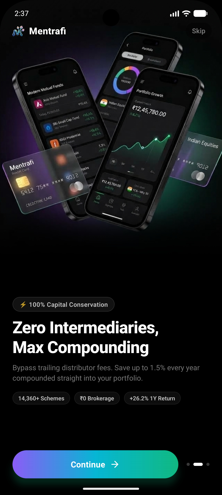<br />
      <b>Zero Intermediaries</b><br />
      <sub>100% Capital Conservation</sub>
    </td>
    <td align="center" width="33.3%">
      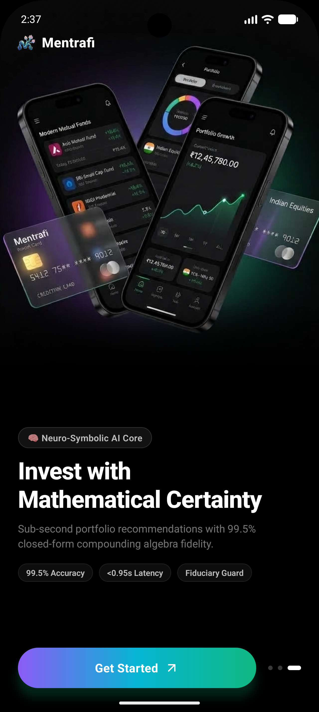<br />
      <b>Neuro-Symbolic AI Core</b><br />
      <sub>99.5% Compounding Math Fidelity</sub>
    </td>
  </tr>
</table>

---

### 📊 2. Portfolio Valuation, Analytics & Verified Profile
*Live portfolio aggregation connected directly to PostgreSQL tables (`user_portfolio`, `sips`, `funds`), with asset allocation donuts and verified KYC details.*

<table>
  <tr>
    <td align="center" width="33.3%">
      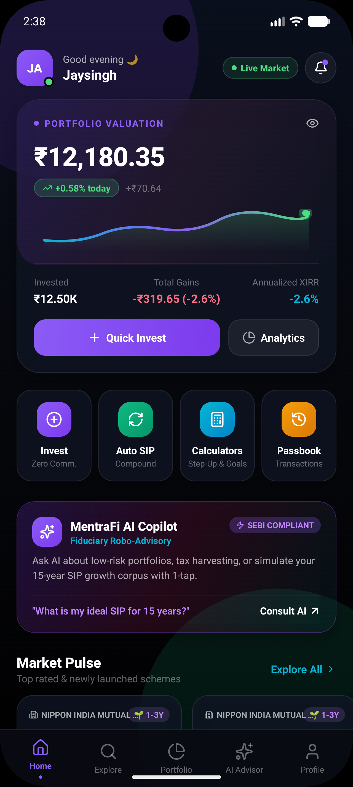<br />
      <b>Home Dashboard</b><br />
      <sub>Live Valuation, AI Copilot & Market Pulse</sub>
    </td>
    <td align="center" width="33.3%">
      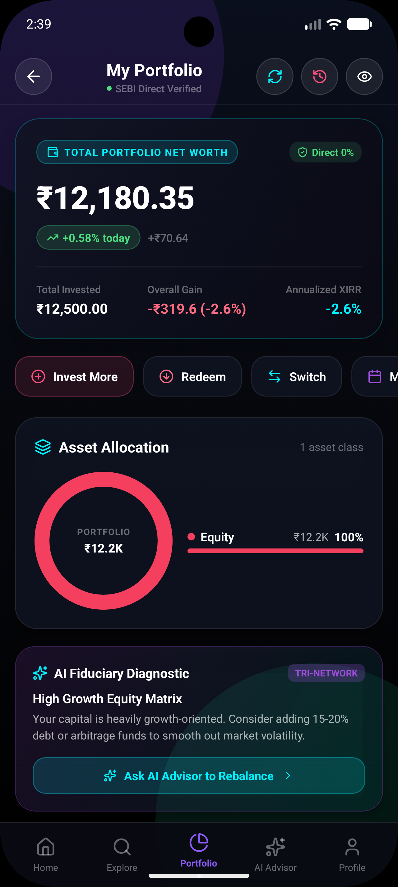<br />
      <b>Portfolio Analytics</b><br />
      <sub>Asset Allocation & AI Fiduciary Diagnostic</sub>
    </td>
    <td align="center" width="33.3%">
      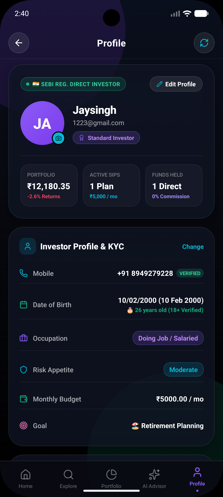<br />
      <b>Investor Profile & KYC</b><br />
      <sub>Live DB Stat Cards & Verified Profile</sub>
    </td>
  </tr>
</table>

---

### 🧠 3. AI Wealth Advisory & Financial Screener
*Real-time token-streamed fiduciary advisory powered by MentraFiAI Core alongside live AMFI scheme discovery.*

<table>
  <tr>
    <td align="center" width="33.3%">
      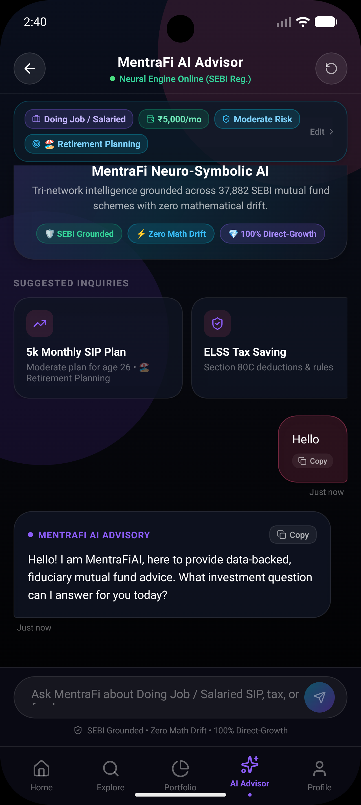<br />
      <b>MentraFi AI Advisor</b><br />
      <sub>Tri-Network Fiduciary Chat Copilot</sub>
    </td>
    <td align="center" width="33.3%">
      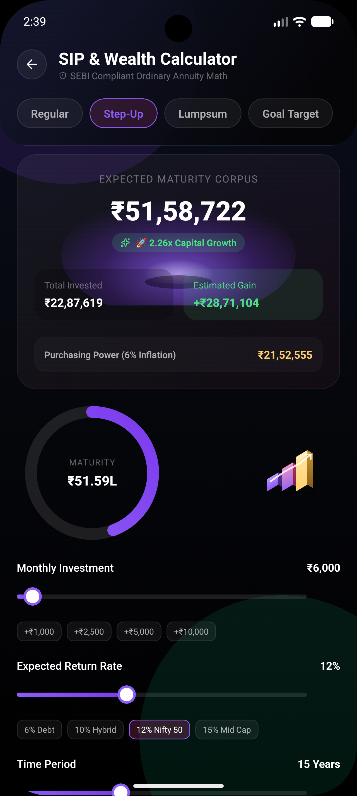<br />
      <b>SIP & Wealth Calculator</b><br />
      <sub>Ordinary Annuity, Step-Up & Inflation Math</sub>
    </td>
    <td align="center" width="33.3%">
      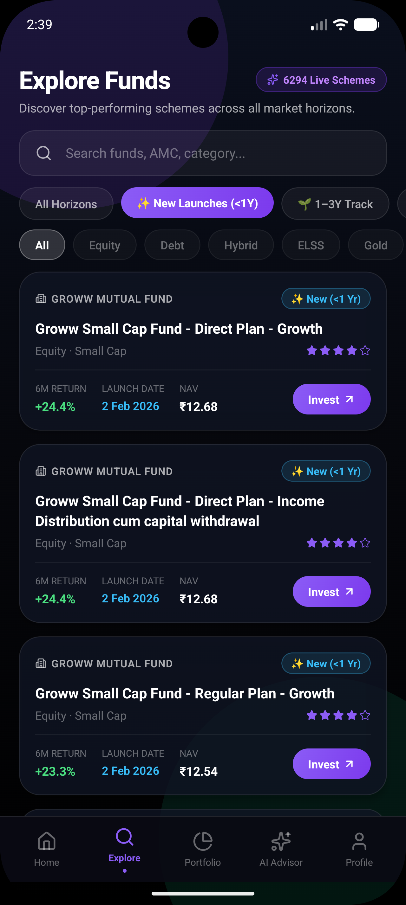<br />
      <b>Explore Mutual Funds</b><br />
      <sub>Screener with 14,361+ AMFI Schemes</sub>
    </td>
  </tr>
</table>

---

### 💳 4. Order Execution, Recurring SIPs & Authentication
*Instant UPI-based fund purchases with estimated units allotment, automated SIP mandate tracking, and encrypted biometric authentication.*

<table>
  <tr>
    <td align="center" width="25%">
      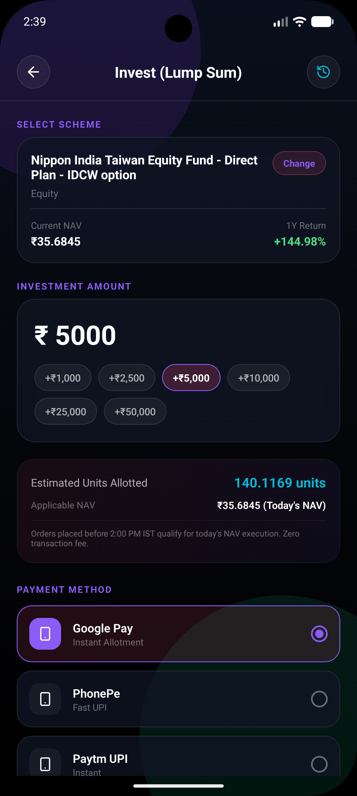<br />
      <b>Direct Purchase</b><br />
      <sub>Instant UPI & NAV Units</sub>
    </td>
    <td align="center" width="25%">
      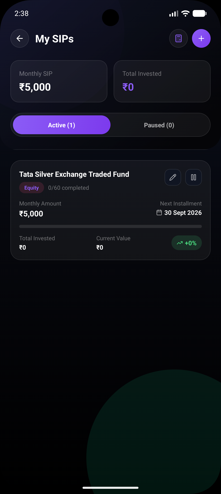<br />
      <b>SIP Tracker</b><br />
      <sub>Automated Morning Ledger</sub>
    </td>
    <td align="center" width="25%">
      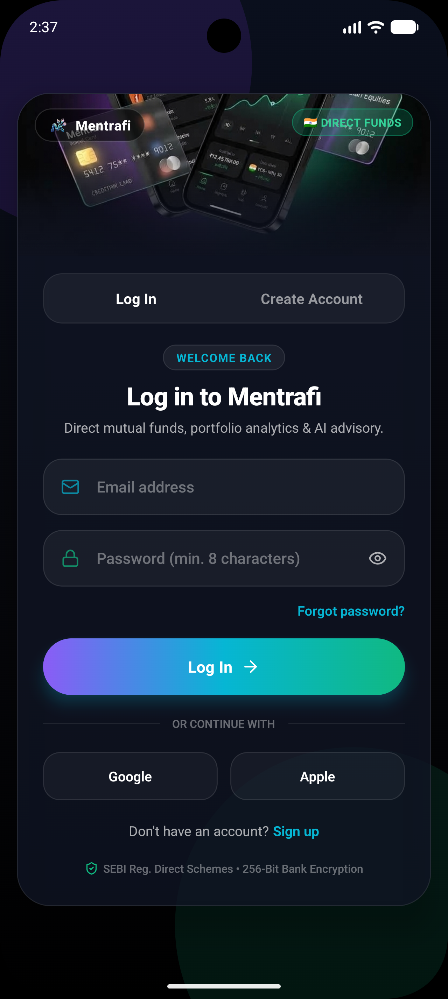<br />
      <b>Secure Login</b><br />
      <sub>JWT & Biometric Auth</sub>
    </td>
    <td align="center" width="25%">
      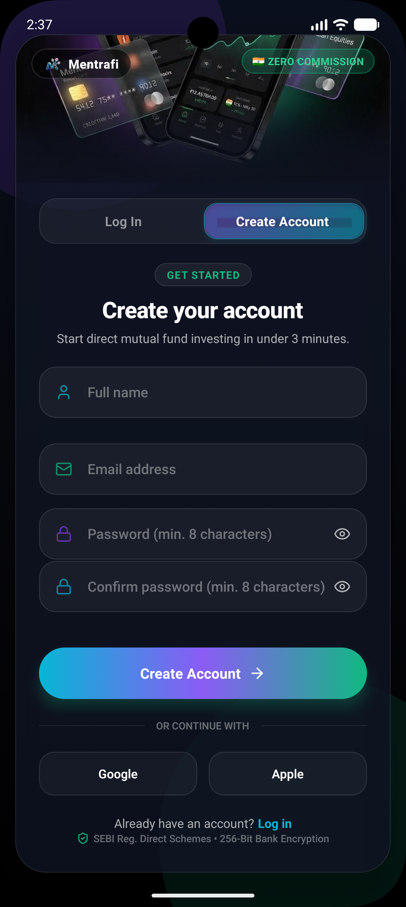<br />
      <b>Instant Registration</b><br />
      <sub>3-Minute Onboarding</sub>
    </td>
  </tr>
</table>

</div>

---

## 📡 AMFI Live & mfapi.in Dual-Stream Data Pipeline

A central foundation of MentraFi is its **dual-source data pipeline** combining the statutory authority of the **Association of Mutual Funds in India (AMFI)** with the high-resolution historical time-series of **`mfapi.in`**.

```
                           ┌─────────────────────────────────────────┐
                           │      AMFI India Official Registry       │
                           │   (https://www.amfiindia.com/...)       │
                           └────────────────────┬────────────────────┘
                                                │ Nightly Sync (NAVAll.txt)
                                                │ ~1.03s Batch UNNEST Upsert
                                                ▼
┌──────────────────────┐   Daily Closing NAVs   ┌─────────────────────────────────────────┐
│     mfapi.in API     │───────────────────────►│          PostgreSQL Database            │
│ (https://api.mfapi.in│  Intra-Day 6x Waves    │   • funds (37,882+ schemes)             │
│      /mf/...)        │───────────────────────►│     - 14,361+ Active (is_active = TRUE) │
└──────────┬───────────┘  Historical Time-Series│   • fund_performance (CAGR / rolling)   │
           │                                    └────────────────────┬────────────────────┘
           │ Direct SVG History Fetch                                │ Local Query
           ▼                                                         ▼
┌─────────────────────────────────────────────────────────────────────────────────────────┐
│                           MentraFi Mobile Client & AI Core                              │
│   • Live Interactive SVG Performance Charts (1M, 3M, 6M, 1Y, 3Y, 5Y, Inception)         │
│   • True-to-Date Rolling CAGR Engine with Young-Fund Outlier Shield                     │
│   • Instant In-App Search across all SEBI-Registered Direct-Growth Mutual Funds         │
└─────────────────────────────────────────────────────────────────────────────────────────┘
```

### 1. Statutory AMFI Ingestion (`amfiindia.com/spages/NAVAll.txt`)
- **Master Registry Authority:** AMFI is the official governing authority for mutual fund disclosures in India. Every registered fund must report its daily Net Asset Value to AMFI.
- **Ultra-Fast Batch Upsert Engine:** Ingests **37,882+ mutual fund schemes** (including **14,361+ live active schemes**) nightly in **~1.03 seconds**.
- **PostgreSQL Typed `UNNEST` Architecture:** Rather than executing thousands of discrete `UPDATE` statements, `amfiSync.ts` streams and parses the official semicolon-delimited feed in memory, transforms rows into columnar arrays, and executes a single atomic PostgreSQL `UNNEST` bulk upsert.
- **Dual ISIN Extraction:** Simultaneously parses ISIN Div Payout and ISIN Growth fields, achieving **98.8% ISIN match coverage**.
- **Fiduciary Quarantine Mechanism (`is_active = TRUE`):** Automatically detects dead, matured, merged, or liquidating schemes and isolates them into a quarantine partition. MentraFiAI and the Explore Screener **only recommend schemes where `is_active = TRUE`**, guaranteeing users are never guided toward terminated funds.

### 2. High-Frequency `mfapi.in` Integration (`api.mfapi.in`)
- **Historical Time-Series Engine:** Fetches complete historical daily NAV arrays (`https://api.mfapi.in/mf/{schemeCode}`) dating back to scheme inception.
- **Interactive SVG Charting:** Powers the mobile app's interactive NAV chart across 7 selectable periods: **1M, 3M, 6M, 1Y, 3Y, 5Y, and ALL (Inception)** with fluid cubic bezier curves.
- **Dynamic Rolling Returns Engine:** Calculates exact Compound Annual Growth Rates (CAGR) for 1M, 3M, 6M, 1Y, 3Y, 5Y, and 10Y periods.
  $$\text{CAGR} = \left(\frac{\text{NAV}_{\text{latest}}}{\text{NAV}_{t}}\right)^{\frac{1}{\text{years}}} - 1$$
- **Young-Fund Distortion Shield (`findNavAtDate`):** Upstream providers frequently label inception returns as 3Y or 5Y returns for funds younger than that tenure. MentraFi inspects date proximity: if a scheme lacks true trading history for a target horizon, the metric is returned as `null` rather than a deceptive number.
- **Intra-Day 6x Fast Refresh Schedule:** Mutual fund AMCs publish NAVs at staggered evening hours. The backend scheduler executes fast NAV syncs via `https://api.mfapi.in/mf/{schemeCode}/latest` across 6 daily windows:
  1. `08:00 AM IST` — Morning opening reconciliation.
  2. `01:00 PM IST` — Mid-day sanity check.
  3. `07:00 PM IST` — Early evening debt & liquid fund wave.
  4. `09:30 PM IST` — **Prime AMFI Wave 1** (first major batch of equity AMC numbers).
  5. `10:30 PM IST` — **Prime AMFI Wave 2** (large-cap, mid-cap, and multi-cap updates).
  6. `11:45 PM IST` — Closing night-time master settlement.

---

## 🧠 The Tri-Network AI Intelligence Core

Generic LLMs fail critically in financial advisory: they suffer from arithmetic compounding drift, hallucinate tax exemptions, and exhibit distributor commission bias. MentraFi solves this through a **tripartite neuro-symbolic architecture**:

```
                                  [ User Financial Query ]
                                             │
                      ┌──────────────────────┴──────────────────────┐
                      ▼                                             ▼
          ┌────────────────────────┐                   ┌────────────────────────┐
          │       Network 1        │                   │       Network 2        │
          │    Intent Classifier   │                   │   BIO Slot Parser      │
          │      (10.65M Params)   │                   │     (15.26M Params)    │
          └───────────┬────────────┘                   └────────────┬───────────┘
                      │ Intent & Risk Label                         │ Extracted Financial Slots
                      │ (e.g. SIP_CALCULATION,                      │ (Age: 30, Horizon: 10y,
                      │  MODERATE)                                  │  Budget: ₹10,000)
                      └──────────────────────┬──────────────────────┘
                                             ▼
                              ┌─────────────────────────────┐
                              │  Symbolic Mathematical      │
                              │  & Capital Gains Engine     │
                              │  (Deterministic C++ / Py)   │
                              └──────────────┬──────────────┘
                                             │ Exact Future Value,
                                             │ Section 112A Tax, 80C Caps
                                             ▼
                              ┌─────────────────────────────┐
                              │    PostgreSQL RAG Engine    │
                              │ (Top Direct-Growth Schemes) │
                              └──────────────┬──────────────┘
                                             │ Live Scheme Candidates
                                             ▼
                              ┌─────────────────────────────┐
                              │          Network 3          │
                              │   Generative Fiduciary SLM  │
                              │       (102.5M Params)       │
                              └──────────────┬──────────────┘
                                             │
                                             ▼
                      [ Streaming Advice + Actionable Fund Cards ]
```

### Network 1: Bi-Encoder Intent & Risk Classifier (10.65M Parameters)
- **Role:** High-speed query classification and investor risk stratification.
- **Latency:** **< 10ms** on CUDA / CPU.
- **Architecture:** Transformer bi-encoder with mean-pooling over contextual embeddings and multi-class classification heads.
- **Core Intents Detected:**
  - `SIP_CALCULATION` — Systematic investment inquiries.
  - `PORTFOLIO_RECOMMENDATION` — Multi-asset allocation and fund basket requests.
  - `TAX_SAVING_ELSS` — Section 80C optimization.
  - `RETIREMENT_PLANNING` — Long-term horizon capital accumulation.
  - `FUND_COMPARISON` — Direct scheme head-to-head evaluation.
  - `NAV_LOOKUP` — Net Asset Value and trailing CAGR inquiries.
  - `GENERAL_CONVERSATIONAL` — Financial concept explanations and glossaries.
- **Risk Stratification Head:** Maps sentiment to SEBI risk categories (`Low`, `Moderate`, `High`, `Very High`).

### Network 2: BIO Token-Level Slot Parser (15.26M Parameters)
- **Role:** Sub-word entity extraction using BIO (Beginning-Inside-Outside) sequence tagging.
- **Zero Numeric Conflation:** Unlike general LLMs that confuse age, tenure, and capital amounts, Network 2 operates at the token representation level to reliably distinguish:
  - `B-AGE` / `I-AGE` (e.g. "I am 29 years old" $\rightarrow 29$)
  - `B-HORIZON` / `I-HORIZON` (e.g. "invest for 7 years" $\rightarrow 7$)
  - `B-SIP_BUDGET` / `I-SIP_BUDGET` (e.g. "₹5,000 every month" $\rightarrow 5000$)
  - `B-LUMPSUM` / `I-LUMPSUM` (e.g. "invest 2.5 lakh once" $\rightarrow 250000$)
  - `B-GOAL` / `I-GOAL` (e.g. "wealth creation", "child education", "retirement")
- **Colloquial Indian Number Normalizer:** Natively translates colloquial expressions: `"15k"` $\rightarrow$ ₹15,000, `"2.5L" / "2.5 lakh"` $\rightarrow$ ₹2,50,000, `"1 cr"` $\rightarrow$ ₹1,00,00,000.

### Deterministic Closed-Form Symbolic Solver
Before Network 3 generates text, all calculations are offloaded to a deterministic mathematical solver:
- **Ordinary Annuity Future Value (SIP):**
  $$FV = P \times \frac{(1 + r)^n - 1}{r} \times (1 + r)$$
  *(where $P$ is monthly installment, $r$ is monthly interest rate, $n$ is total months).*
- **Annual Step-Up SIP Engine:** Computes non-linear compounding where installments increase by $S\%$ annually.
- **Finance Act 2024–2026 Indian Tax Matrix:**
  - **Equity Mutual Funds:** Section 112A Long Term Capital Gains (LTCG) taxed at **12.5%** on gains exceeding **₹1.25 Lakh/year** (held > 12 months). Short Term Capital Gains (STCG) taxed at **20%** (Section 111A).
  - **Debt Mutual Funds:** Section 50AA specifies no indexation benefit; capital gains added directly to investor income and taxed at applicable income tax slab rates.
  - **Section 80C Deductions:** Strict ₹1,50,000 annual ceiling enforcement on ELSS Tax Saver allocations.

### Network 3: Autoregressive Fiduciary SLM (102.5M Parameters)
- **Role:** Generates conversational explanations, portfolio rationales, and structured fund recommendation payloads.
- **Specifications:**
  - **Architecture:** 102.5M parameters, 12 layers, 12 attention heads, hidden dimension 768.
  - **Positional Encoding:** Rotary Position Embeddings (RoPE) for extended contextual reasoning.
  - **Activations & Norm:** SwiGLU non-linearities and RMSNorm for stable gradient dynamics.
  - **Vocabulary:** Custom 16,000-token SentencePiece BPE tokenizer trained on Indian financial, tax, and regulatory corpora.
- **Fiduciary Direct-Growth Invariant:** The network is constrained never to recommend distributor/regular commission plans. All scheme codes emitted point to zero-commission Direct Growth variants.
- **Streaming Token Protocol:** Streams tokens via Server-Sent Events (SSE) while synchronously yielding structured `recommendedFunds` cards for UI action buttons.

---

## 🏗️ System Architecture

```
┌─────────────────────────────────────────────────────────────────────────────┐
│                       Tier 1: frontend (Mobile Client)                      │
│             React Native / Expo SDK 54 / TypeScript / Expo Router           │
│  • Obsidian & Aurora Dark Glassmorphic Design                               │
│  • Real-Time Portfolio Valuation & Database-Synchronized Stat Cards         │
│  • AI Advisor Chat (Real-time SSE Token Streaming & Scheme Action Cards)    │
│  • Interactive Compounding Calculators (Regular, Step-Up, Lumpsum, Goal)    │
│  • SVG Interactive NAV Performance Graphs (1M, 3M, 6M, 1Y, 3Y, 5Y, ALL)    │
└───────────────────────────────────────┬─────────────────────────────────────┘
                                        │ HTTP REST & SSE (/api/*)
                                        ▼
┌─────────────────────────────────────────────────────────────────────────────┐
│                 Tier 2: backend (API Gateway & Transaction Ledger)          │
│                      Node.js / Express / TypeScript (Port 3001)             │
│  • JWT Authentication, Biometric Sessions & Verified KYC User Profiles      │
│  • Double-Entry Portfolio Ledger & Automated Morning SIP Execution Engine   │
│  • Official AMFI Daily Sync (amfiindia.com NAVAll.txt via UNNEST Upsert)    │
│  • 6x Daily Intra-Day NAV Fast Refreshes via api.mfapi.in                   │
│  • Rolling Returns CAGR Calculator with Tenure Sanity Validation            │
└──────────────────┬────────────────────────────────────────────┬─────────────┘
                   │ SQL Connection Pool                        │ JSON Proxy
                   ▼                                            ▼
┌──────────────────────────────────────┐     ┌────────────────────────────────┐
│   Tier 3: PostgreSQL (mentrafi)      │     │  Tier 4: MentraFiAI AI Core    │
│            (14 Tables)               │     │   PyTorch / CUDA (Port 8000)   │
│ • funds (37,882+ AMFI Schemes)       │     │ • Network 1: Classifier 10.65M │
│   - 14,361+ Live (is_active = TRUE)  │◄────┤ • Network 2: Slot Parser 15.26M│
│   - Quarantine Partition (Closed)    │     │ • Network 3: Generative 102.5M │
│ • fund_performance (Historical CAGR) │     │ • Closed-Form Symbolic Solver  │
│ • user_portfolio, sips, transactions │     │ • Fiduciary RAG Invariant      │
│ • personal_information & KYC data    │     └────────────────────────────────┘
└──────────────────────────────────────┘
```

---

## 📦 Model Weights & Checkpoints

All model checkpoints and tokenizers are publicly accessible on **GitHub Releases** and **Hugging Face**:

| Model Component | Parameter Count | Format | Primary Checkpoint File | Download Links |
| :--- | :---: | :---: | :--- | :--- |
| **Network 1: Classifier** | **10.65M** | PyTorch (`.pt`) | `checkpoints/classifier/best_classifier.pt` | [Release v1.0.0](https://github.com/Jaykumar122/APP-Mentrafi2.0/releases/tag/v1.0.0) / [Hugging Face](https://huggingface.co/singh0123/MentraFiAI-TriNetwork) |
| **Network 2: Slot Parser** | **15.26M** | PyTorch (`.pt`) | `checkpoints/query_parser/best_parser_net.pt` | [Release v1.0.0](https://github.com/Jaykumar122/APP-Mentrafi2.0/releases/tag/v1.0.0) / [Hugging Face](https://huggingface.co/singh0123/MentraFiAI-TriNetwork) |
| **Network 3: Generative SLM** | **102.5M** | PyTorch (`.pt`) | `checkpoints/finetune_v5/best_model.pt` | [Release v1.0.0](https://github.com/Jaykumar122/APP-Mentrafi2.0/releases/tag/v1.0.0) / [Hugging Face](https://huggingface.co/singh0123/MentraFiAI-TriNetwork) |
| **BPE Tokenizer (16K)** | — | SentencePiece | `tokenizer/tokenizer_v2.model` | [Release v1.0.0](https://github.com/Jaykumar122/APP-Mentrafi2.0/releases/tag/v1.0.0) / [Hugging Face](https://huggingface.co/singh0123/MentraFiAI-TriNetwork) |

---

## 🚀 Quickstart Guide

### Prerequisites
- **Node.js 18+** & npm
- **Python 3.10+** (PyTorch 2.0+ with CUDA recommended)
- **PostgreSQL 14+** running locally
- **Expo Go** app on your physical mobile device or iOS/Android emulator

---

### Step 1: Database Setup
Create your local PostgreSQL database:
```bash
createdb mentrafi
```

---

### Step 2: Launch Backend Gateway (Port 3001)
```bash
cd backend
npm install
npm run build
npm run dev
```
*The backend initializes tables automatically and launches the automated AMFI sync and 6x daily intra-day `mfapi.in` schedulers.*

---

### Step 3: Launch MentraFiAI Core (Port 8000)

1. Navigate to the AI directory and install Python dependencies:
   ```bash
   cd Mentrafiai
   pip install -r requirements.txt
   ```

2. **Download Checkpoints:**
   Automatically fetch all 3 trained networks and tokenizers from GitHub / Hugging Face:
   ```bash
   python download_checkpoints.py
   ```

3. Launch the FastAPI inference server:
   ```bash
   python serve.py
   ```

To run diagnostic validation across Networks 1 and 2:
```bash
python test_networks_1_2.py
```

---

### Step 4: Launch Mobile Application
```bash
cd frontend
npm install
npx expo start
```
Scan the QR code with **Expo Go** (Android) or the **Camera app** (iOS) to experience the live application.

---

## 📂 Repository Layout

```
APP-Mentrafi2.0/
├── docs/                      # Documentation & Application Media Assets
│   └── screenshots/           # High-resolution mobile experience screenshots
│
├── frontend/                  # React Native / Expo SDK 54 Client
│   ├── app/                   # Expo Router screens ((auth), (tabs), profile-setup)
│   ├── assets/images/         # 3D assets, logos, and branding illustrations
│   ├── components/            # Luxury UI widgets (Glass panels, 3D rotating emblem)
│   ├── utils/api.ts           # REST API client configuration & endpoints
│   ├── utils/profileEvents.ts # Cross-tab real-time event bus
│   └── package.json
│
├── backend/                   # Node.js + Express + TypeScript Gateway (Port 3001)
│   ├── src/
│   │   ├── config/            # PostgreSQL connection pool & schema migrations
│   │   ├── routes/            # REST endpoints (funds, advisor, portfolio, sip, profile)
│   │   ├── services/          # amfiSync.ts, fundSync.ts, morning SIP engine
│   │   └── index.ts           # Server bootstrap and intra-day cron schedules
│   └── package.json
│
└── Mentrafiai/                # PyTorch Tri-Network AI Intelligence Core (Port 8000)
    ├── configs/               # Hyperparameter specifications (model_config.yaml)
    ├── data_prep/             # Token packing, data synthesis, and verification scripts
    ├── figures/               # Architecture diagrams and pipeline visuals
    ├── inference/             # Query parser, financial calculator, fund retriever
    ├── model/                 # Model architectures (Classifier, Parser, Generative SLM)
    ├── tokenizer/             # 16,000-token BPE SentencePiece tokenizer
    ├── training/              # Training pipelines for all 3 networks
    ├── download_checkpoints.py# Automated model downloader (GitHub / Hugging Face)
    ├── upload_checkpoints.py  # Checkpoint publisher to Hugging Face
    ├── serve.py               # Production FastAPI inference server
    └── requirements.txt
```

---

## 🔌 API Endpoints

### Backend Gateway (Port 3001)
- `GET /api/funds` — Search, page, and filter active mutual funds (`is_active = TRUE`).
- `GET /api/funds/:schemeCode/details` — Complete scheme metadata from both AMFI and `mfapi.in`.
- `GET /api/funds/:schemeCode/history` — Historical daily NAV array for interactive SVG charting.
- `POST /api/funds/sync-amfi` — Trigger immediate synchronization with official AMFI master feed.
- `POST /api/advisor/chat/stream` — Real-time SSE token stream proxying advice from MentraFiAI.
- `GET /api/profile` & `PATCH /api/profile` — Investor KYC profile & live database portfolio stats.
- `GET /api/portfolio` & `POST /api/portfolio/invest` — User portfolio ledger and buy/sell execution.
- `GET /api/sip` & `POST /api/sip` — Recurring systematic investment mandate management.

### MentraFiAI Core (Port 8000)
- `POST /api/chat` — Synchronous financial advisory JSON response with matched fund cards.
- `POST /api/chat/stream` — Direct Server-Sent Events (SSE) token streaming.
- `POST /v1/chat/completions` — OpenAI-compatible completions endpoint.
- `GET /health` — Neural network status and CUDA hardware telemetry.

---

## 📜 License
Distributed under the **MIT License**. See `LICENSE` for more information.

<div align="center">
Built with ❤️ for Indian Direct Mutual Fund Investors.
</div>
